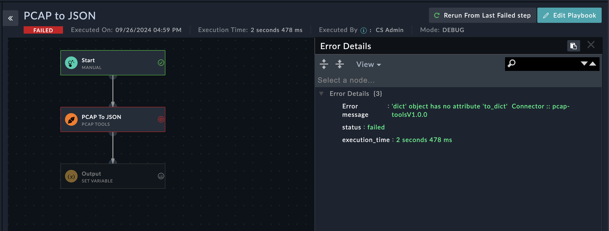

## About the connector
PCAP Tools decodes a pcap file and converts it to human readable format
<p>This document provides information about the PCAP Tools Connector, which facilitates automated interactions, with a PCAP Tools server using FortiSOAR&trade; playbooks. Add the PCAP Tools Connector as a step in FortiSOAR&trade; playbooks and perform automated operations with PCAP Tools.</p>

### Version information

Connector Version: 1.0.0


Authored By: Fortinet CSE

Contributors: Naili.M

Certified: No
## Installing the connector
<p>Use the <strong>Content Hub</strong> to install the connector. For the detailed procedure to install a connector, click <a href="https://docs.fortinet.com/document/fortisoar/0.0.0/installing-a-connector/1/installing-a-connector" target="_top">here</a>.</p><p>You can also use the <code>yum</code> command as a root user to install the connector:</p>
<pre>yum install cyops-connector-pcap-tools</pre>

## Prerequisites to configuring the connector
There are no prerequisites to configuring this connector.

## Minimum Permissions Required
- Not applicable

## Configuring the connector
For the procedure to configure a connector, click [here](https://docs.fortinet.com/document/fortisoar/0.0.0/configuring-a-connector/1/configuring-a-connector)
### Configuration parameters
None.

## Actions supported by the connector
The following automated operations can be included in playbooks and you can also use the annotations to access operations:
<table border=1><thead><tr><th>Function</th><th>Description</th><th>Annotation and Category</th></tr></thead><tbody><tr><td>PCAP To JSON</td><td>Convert a PCAP (Packet Capture) file into a JSON format for easier analysis.</td><td>pcap_to_json <br/>Investigation</td></tr>
</tbody></table>

### operation: PCAP To JSON
#### Input parameters
<table border=1><thead><tr><th>Parameter</th><th>Description</th></tr></thead><tbody><tr><td>File IRI</td><td>Specify the IRI of the PCAP file or the attachment in FortiSOAR to convert it into JSON
</td></tr></tbody></table>

#### Output
The output contains the following populated JSON schema:

<pre>[
    {
        "Text": "",
        "Format": "",
        "Content": "",
        "Position": ""
    }
]</pre>

Included playbooks
The Sample - PCAP Tools - 1.0.0 playbook collection comes bundled with the Exchange connector. This playbook contains steps using which you can perform all supported actions. You can see the bundled playbooks in the Automation > Playbooks section in FortiSOAR™ after importing the PCAP Tool connector.
- PCAP to JSON


**Troubleshooting**

"Errors occurred while executing connector actions `PCAP to JSON`: getting the error `dict` object has no attribute `to_dict`


Resolution:

If this issue occurs on a FortiSOAR system, then do the following to resolve this issue:

Follow these steps to update your FortiSOAR system:

1. SSH into your FortiSOAR system.
   
2. Open the `common.py` file with the following command:
   ```bash
   vi /opt/cyops/configs/integrations/packages/lib/python3.9/site-packages/pcapkit/dumpkit/common.py
3. Search for the following code snippet in the common.py file:

```python 
if isinstance(o, (Info, Schema)):
    return o.to_dict()

```
Replaced  the `return o.to_dict()` with `return o`

After replacing the code, it will be displayed as. 

```python 
if isinstance(o, (Info, Schema)):
    return o

```
4. Restart the uwsgi service using the following command:

```bash
systemctl restart uwsgi


